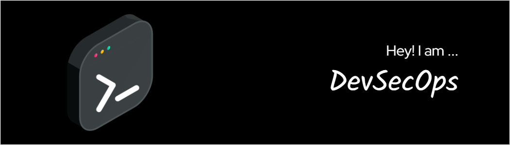

<h1 align="center">Hi there 👋</h1>

Cybersecurity professional with a passion for protecting systems and data from unauthorized access. Experienced in vulnerability assessment, penetration testing, and incident response. Proven ability to identify and mitigate security risks.

Technical Skills:

Programming languages: Python, Java, C++
Operating systems: Windows, Linux, macOS
Networking: TCP/IP, OSI model
Security tools: Nmap, Nessus, Burp Suite
Experience:

Vulnerability Analyst at Acme Corporation, 2022-Present

Conducted vulnerability assessments and penetration tests on internal and external systems
Developed and implemented security remediation plans
Provided security awareness training to employees
Security Intern at XYZ Technologies, 2021

Assisted with vulnerability assessments and penetration tests
Researched and reported on emerging security threats
Developed a security awareness training program for interns
Education:

Master of Science in Cybersecurity from Stanford University, 2020
Bachelor of Science in Computer Science from University of California, Berkeley, 2018
Awards and Recognition:

Cybersecurity Scholarship from the National Science Foundation, 2020
Dean's List at Stanford University, 2019
In addition to my technical skills and experience, I am also a creative thinker and problem solver. I am passionate about cybersecurity and I am always looking for new ways to improve security practices. I am also a team player and I am always willing to help others.

